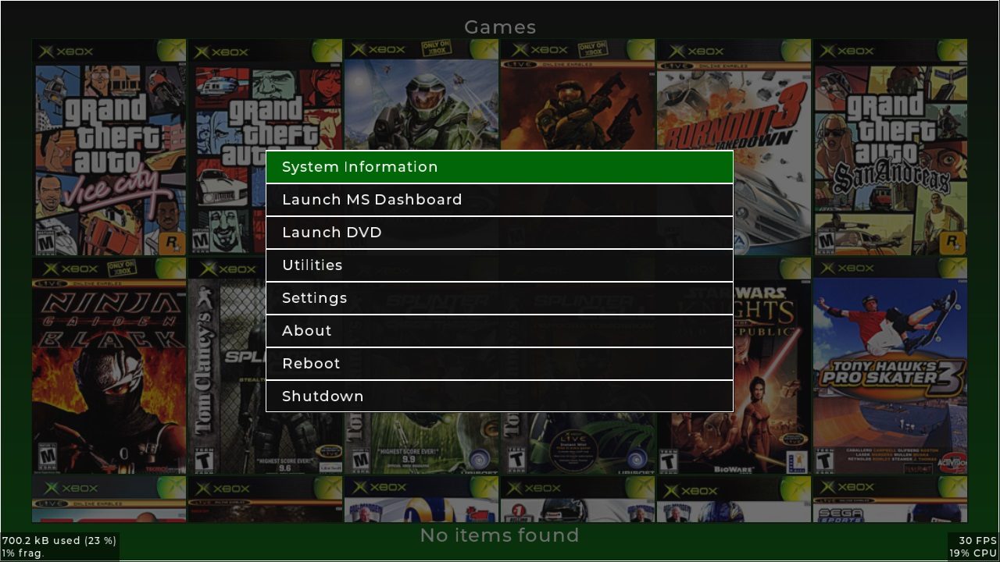
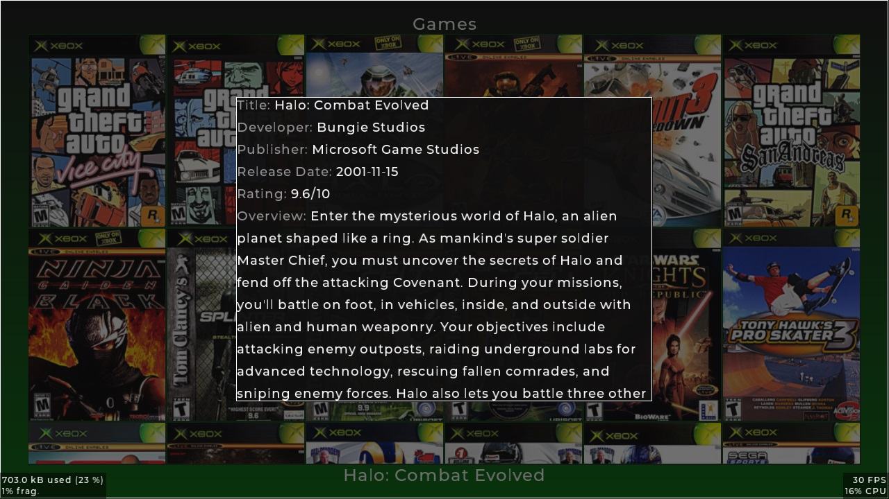

# LithiumX

A simple dashboard, mainly developed for the Original Xbox console, but it can be compiled for Windows and Linux for rapid development and testing.


## Features
* Customisable search paths and pages.
* Supports game synopsis information and boxart using the [XBMC4Gamers artwork format](https://github.com/Rocky5/XBMC4Gamers/blob/master/README.md#game-resources-and-synopsis). [Google Drive Link](https://drive.google.com/file/d/1Y3_21N8yDqYJ1CznaP6ceMM87JHpTHwd/view?usp=sharing)
* Keeps track of recently launched titles to quickly get back into your games.
* Will run at 720p if available, otherwise it will automatically fallback to 480p.
* FTP Server (Xbox build only)
* GPU Accelerated
* EEPROM configuration and backup
* XBE Browser (Browse and launch XBEs on your HDD or DVD drive.

## Controls
* Black/White - Change page
* LT/RT - Scroll page
* D-PAD - Select title
* Back/Select - Show synopsis screen
* Start - Show main menu
* A - Launch selected title

## Game Search Paths
* On the first launch, a `lithiumx.toml` will be created at "E:/UDATA/LithiumX" with a starting template. Edit this to modify search paths for titles.
* If the template is invalid, the program will reset it back to the inbuilt default.

## Todo
- [ ] Some basic audio.
- [ ] File browser.
- [ ] Lots more testing.

## Images





## Build (Original Xbox Version)
Setup and install nxdk, then:
```
sudo apt-get update -y && sudo apt-get install -y flex bison clang lld llvm
git clone --recursive https://github.com/Ryzee119/LithiumX.git
cd LithiumX
./src/libs/nxdk/bin/activate
make -f Makefile.nxdk -j (Add -B if editing lv_conf.h or other header files to ensure its built correctly)
```

## Build (Windows Version)
Install MSYS2, then from a mingw64 environment:
```
pacman -Syu
pacman -S mingw-w64-x86_64-make \
          mingw-w64-x86_64-cmake \
          mingw-w64-x86_64-gcc \
          mingw-w64-x86_64-SDL2 \
          mingw-w64-x86_64-libjpeg-turbo

git clone --recursive https://github.com/Ryzee119/LithiumX.git
cd LithiumX/
mkdir build && cd build
cmake .. -G "MinGW Makefiles"
cmake --build .
```

## Licence and Attribution
This project is shared under the [MIT license](https://github.com/Ryzee119/LithiumX/blob/master/LICENSE), however this project includes code by others. Refer to the list below.
* [lvgl](https://github.com/lvgl)/**[lvgl](https://github.com/lvgl/lvgl)** shared under the [MIT License](https://github.com/lvgl/lvgl/blob/master/LICENCE.txt).
* [charlesnicholson](https://github.com/charlesnicholson)/**[nanoprintf](https://github.com/charlesnicholson/nanoprintf)** shared under the [MIT License](https://github.com/charlesnicholson/nanoprintf/blob/main/LICENSE).
* [capmar](https://github.com/capmar/)/**[sxml](https://github.com/capmar/sxml)** shared under the [UNLICENSE](https://github.com/capmar/sxml/blob/master/UNLICENSE).
* [cktan](https://github.com/cktan/)/**[tomlc99](https://github.com/cktan/tomlc99)** shared under the [MIT License](https://github.com/cktan/tomlc99/blob/master/LICENSE).
* [XboxDev](https://github.com/XboxDev)/**[nxdk](https://github.com/XboxDev/nxdk)** shared under the [Various Licenses](https://github.com/XboxDev/nxdk/tree/master/LICENSES).
* [sandertrilectronics](https://github.com/sandertrilectronics)/**[LWIP-FreeRTOS-FTP-Server](https://github.com/sandertrilectronics/LWIP-FreeRTOS-Netconn-FTP-Server)** shared under the [Apache 2.0 License](https://github.com/Ryzee119/LithiumX/blob/master/src/lib/ftpd/LICENSE).
